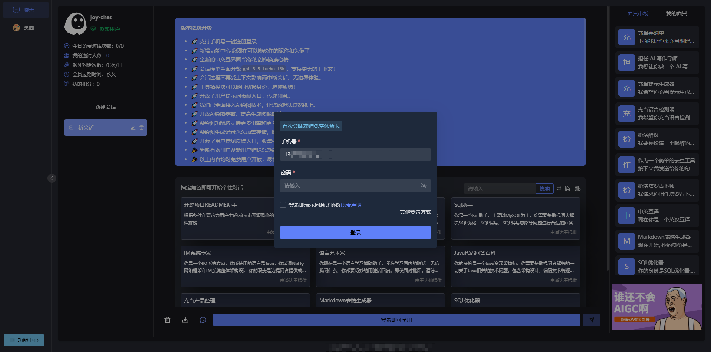
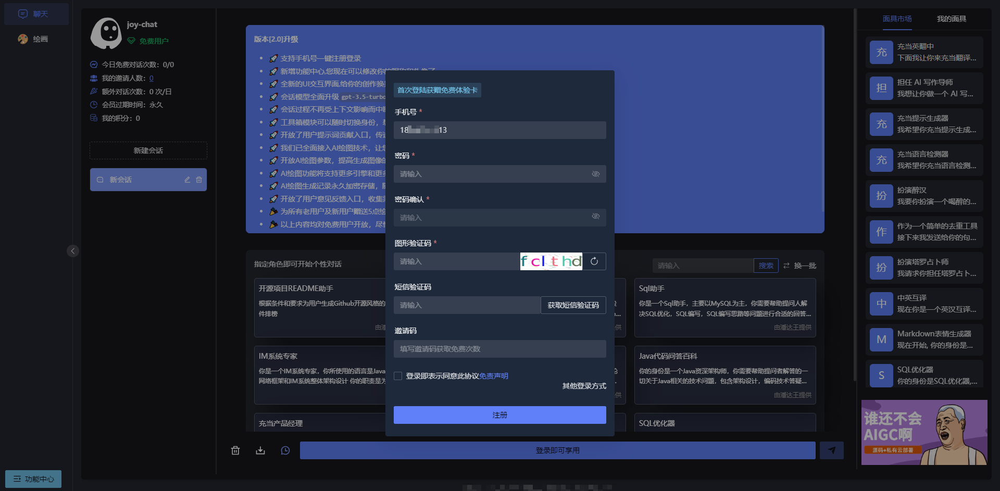
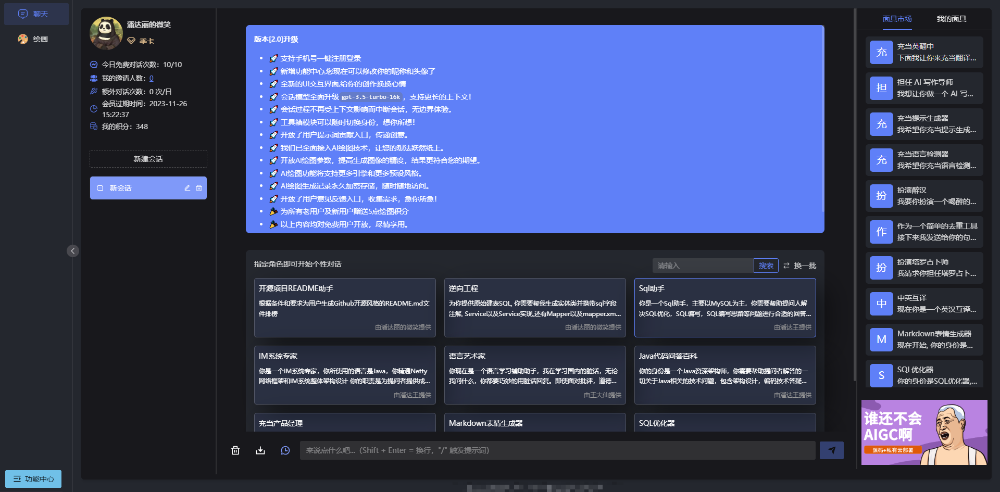
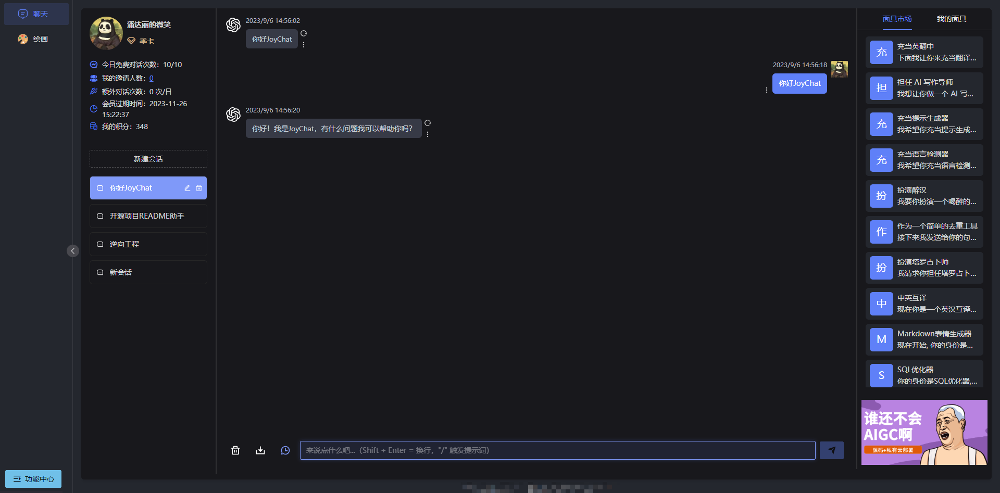

  

JoyChat-AI助手,界面美观,强大易用,可快速部署的GPT-Web客户端

## 鸣谢:

- 感谢[@Grt1228](https://github.com/Grt1228)作者开源的[chatgpt-java](https://github.com/Grt1228/chatgpt-java)

- 感谢[@hncboy](https://github.com/hncboy) 作者早期 chatgpt-web-java 项目给予的启发

## 介绍:

- 该项目为JoyChat后端项目

- 前端开发: [@wangchuanwc](https://github.com/wangchuanwc)
- 前端项目:
- 管理端项目:
- JoyChat 没有什么特别含义,作者希望每一个愿意使用我们作品的人,都能够体会AI带来的乐趣和启发.共勉!
- 如果有朋友不会的,可以联系我们

## 联系我们
  

## 界面预览:

- ### **登录**

  

- ### **注册**

  

- ### **首页**

  

- ### **对话**

- 

## 体验地址

[JoyChat-AI助手](https://joychat.cceven.cc)

## 环境要求

- **JDK17**

- **SpringBoot3.0**

- **MVN项目管理工具**

- **Redis缓存中间件**

- **MySql5.7或以上版本**

- **Lombok**

- **Hutool**

- **SaToken**

- **MyBatis-Plus**

- **Docker**

  .....

## 功能介绍

- **多种注册方式**: 支持手机号注册,支持邮箱注册

- **多种登录方式**: 手机号验证码登录,手机号密码登录,邮箱密码登录。

- **ApiKey轮询**: 同时配置多个ApiKey,当某个ApiKey失效时,系统会移除失效ApiKey并轮询其他有效的ApiKey

- **ApiKey失效告警**: 可在管理端 `openAI`配置处配置告警邮箱地址,当任意key失效,会通过邮箱进行通知告警

- **OpenAI相关配置动态刷新**: 管理端进行ApiKey配置,配置后立即生效

- **敏感词保护**: 本地敏感词校验/百度文本审核双重敏感词校验保护机制

- **无界上下文体验**: 上下文动态清理,不会因为上下文过长而导致会话终端。

- **自定义提示词**: JoyChat允许用户个性化调整其行为，如调整辅助水平、定义偏好话题和自定义用户界面。

- **自动发布部署**: 得益于gitHubActions, JoyChat支持Docker自动发布部署

  代码相对开放,可自行对功能进行修改或新增

  ......

## 部署运行

## >>>> **无需手动打包部署** <<<<

### 1.前置条件:

- MySql
- Redis
- Maven
- DockerHub账号
- Nginx

### 2.执行数据库脚本

- 数据库脚本位置:

### 3.修改application.yml配置(修改为自己的配置)

### 4.修改Dockerfile文件路径

### 5.修改github/workflows/docker-java-client.yml文件,配置服务器地址

### 6.将代码推送至docker-java-client.yml中定义的目标分支,JoyChat会自行打包-push到Docker-服务器拉取docker镜像-然后启动

## 提问:

**可以提Issue或者加作者微信**